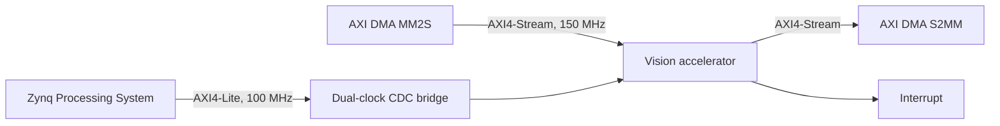

# ZB AI Vision Accelerator

Reusable FPGA image-preprocessing IP for 28x28 grayscale AXI4-Stream frames,
implemented and verified as a Zynq UltraScale+ production design.

## Architecture



The design supports four selectable modes:

| Mode | Operation | Output |
| ---: | --- | --- |
| 0 | Binary threshold | One 8-bit value per pixel |
| 1 | Sobel magnitude | One 8-bit value per pixel |
| 2 | Learned signed-INT8 3x3 convolution | One 8-bit activation |
| 3 | Four learned signed-INT8 3x3 convolutions | Four packed 8-bit activations |

The production wrapper adds AXI4-Lite control, AXI DMA integration, diagnostics,
interrupt status, register-version discovery, and a dual-clock CDC bridge.

## Implementation snapshot

| Item | Result |
| --- | --- |
| Target | Avnet Ultra96-V2, `xczu3eg-sbva484-1-i` |
| Clocks | 100 MHz control, 150.015 MHz stream/data |
| Timing | +1.951 ns setup WNS, +0.010 ns hold WHS, zero failing endpoints |
| Signoff checks | Zero CDC critical/warning, methodology, and DRC error/critical-warning findings |
| Utilization | 15.54% LUT, 9.64% registers, 2.78% BRAM, 12.50% DSP |
| Estimated power | 2.084 W |

## Verification summary

- Python predictor: 6,272/6,272 packed outputs matched.
- Directed RTL: all four modes, backpressure, consecutive frames, and error paths pass.
- Scalable convolution: 1-, 2-, and 4-filter configurations pass.
- CDC stress: three asynchronous clock ratios, skewed AXI-Lite accesses,
  reset-abort recovery, response flushing, and IRQ crossing pass.
- UVM: 11 focused tests plus a 100-seed randomized predictor run pass with zero
  UVM errors/fatals, assertion failures, or simulator errors.
- Targeted functional coverage: 100%.

Run the local checks from the repository root:

```powershell
powershell -ExecutionPolicy Bypass -File .\scripts\run_local_rtl_regression.ps1
```

## Release artifacts

The [Ultra96-V2 production release candidate](https://github.com/michaelgirg/zynq-ultra96-ai-vision-accelerator/releases/tag/ultra96-v2-rc1)
contains the bitstream, bitstream-inclusive XSA, and SHA256 manifest. Generated
Vivado/Vitis projects, simulator databases, logs, local machine settings, and
release binaries are excluded from the source tree.

## Ultra96-V2 production flow

The V2 flow targets the Avnet Ultra96-V2 ZU3EG device with a 100 MHz control
clock and 150 MHz stream/data clock. It uses AMD/Xilinx XPM CDC primitives for
single-bit and bundled-data crossings and emits reproducible Vivado reports.

Set `ULTRA96_BOARD_REPO` to the board-store directory on the build machine,
then run the V2 Tcl scripts through Vivado 2025.2. The project creator refuses
to overwrite an existing generated project.

The control/register definitions are documented in
[`docs/register_map.md`](docs/register_map.md). Final production evidence is
summarized in [`docs/production_v2_release_status.md`](docs/production_v2_release_status.md).
See [`docs/README.md`](docs/README.md) for the current design documents and
historical engineering snapshots.

## Repository layout

```text
rtl/        synthesizable SystemVerilog datapaths and CDC wrapper
tb/         directed self-checking RTL testbenches
verif/      assertions, BFMs, UVM environment, and coverage
generated/  compact deterministic models, headers, and test vectors
pytorch/    quantization and golden-model utilities
vivado/     packaging and Ultra96-V2 build Tcl
scripts/    local regression and predictor utilities
docs/       current design contract and historical engineering evidence
```
